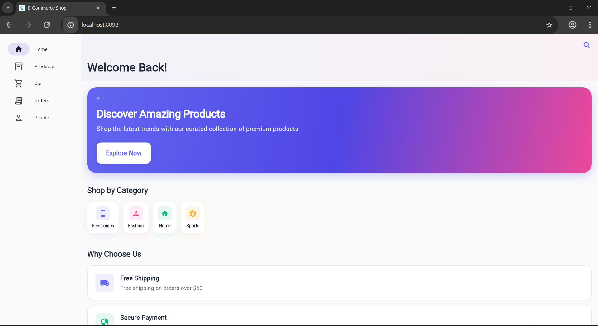
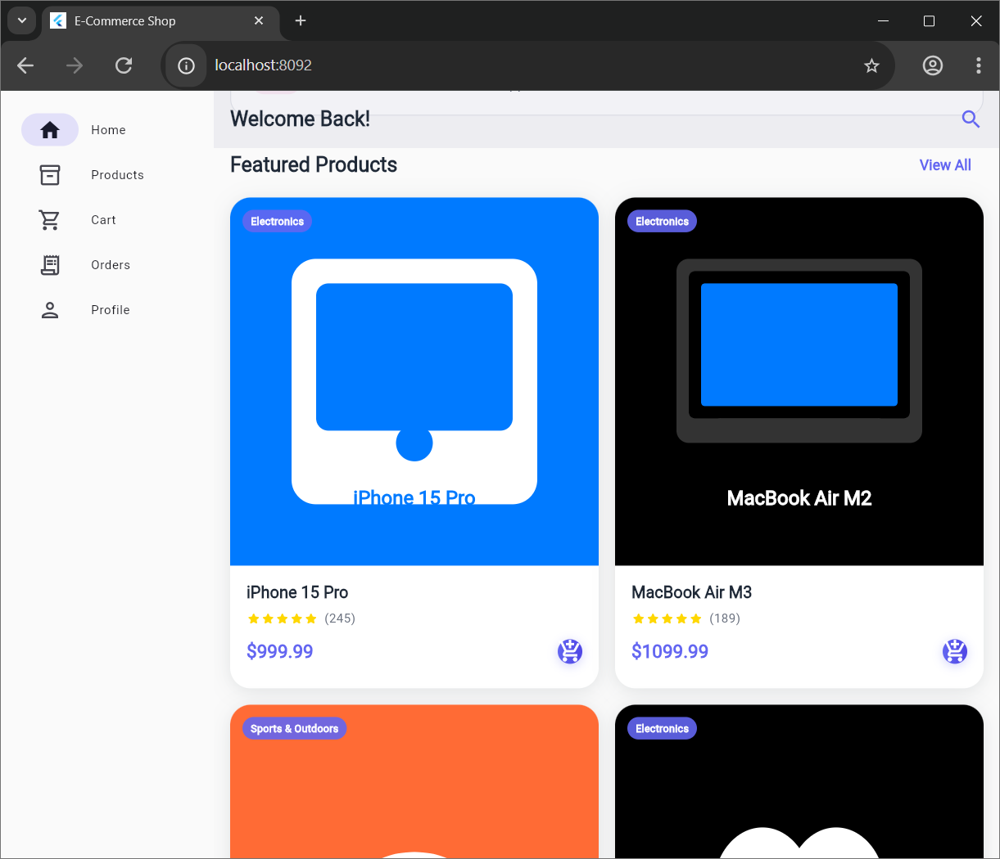

# 🛍️ Flutter E-Commerce App

A modern, responsive e-commerce application built with Flutter featuring adaptive layouts, Material Design 3, and a complete shopping experience. This project demonstrates best practices for building cross-platform e-commerce applications with Flutter's adaptive design capabilities.

## ✨ Features



### 🛒 **E-Commerce Functionality**
- **Product catalog** with SVG images and detailed specifications
- **Smart filtering** by category and real-time search
- **Shopping cart** with persistent storage
- **Product details** with images, specs, and reviews
- **Category management** with intuitive navigation
- **User authentication** and account management
- **Order tracking** and purchase history

### 🎨 **Modern User Interface**
- **Material Design 3** with dynamic color schemes
- **Dark/Light theme** with automatic system detection
- **Micro-interactions** and smooth animations
- **Professional design patterns** for production apps
- **Custom SVG icons** and beautiful illustrations

### 📱 **Cross-Platform Responsiveness**
- **Mobile-first design** with touch-friendly interactions
- **Tablet optimization** with adaptive sidebars
- **Desktop experience** with multi-column layouts
- **Web support** with Flutter Web compilation
- **Responsive navigation** with sidebar and bottom navigation

### 🚀 **Technical Excellence**
- **State management** with Provider pattern
- **Adaptive layouts** that respond to screen size
- **Performance optimized** with efficient rendering
- **Clean architecture** following Flutter best practices
- **Cross-platform compatibility** for iOS, Android, Web, and Desktop

## 📱 **Adaptive Design Showcase**

### **Tablet Interface**


*Responsive tablet layout with adaptive sidebar navigation and optimized touch targets*

## 🎯 **Screenshots & Demos**

### **Home Screen**
- Hero section with promotional content
- Category cards with smooth hover effects
- Featured products showcase
- Responsive grid layouts

### **Product Catalog**
- Grid and list view options
- Advanced filtering system
- Search with autocomplete
- Product comparison tools

### **Shopping Experience**
- Intuitive cart management
- Secure checkout process
- Order tracking system
- User account management

## 🛠️ **Technologies Used**

- **Frontend**: Flutter 3.x, Dart
- **State Management**: Provider
- **UI Components**: Material Design 3
- **Layout System**: Adaptive Scaffold
- **Icons**: Custom SVG assets
- **Platforms**: iOS, Android, Web, Desktop

## 📱 **Platform Support**

| Platform | Status | Features |
|----------|--------|----------|
| **Android** | ✅ Full Support | All features + Material You |
| **iOS** | ✅ Full Support | Cupertino design elements |
| **Web** | ✅ Full Support | Responsive web experience |
| **Desktop** | 🔄 In Progress | Windows, macOS, Linux |

## 🚀 **Getting Started**

### **Prerequisites**
- Flutter SDK 3.0+
- Dart 2.17+
- Android Studio / VS Code
- Git

### **Installation**
```bash
# Clone the repository
git clone https://github.com/michaelgermini/flutter-ecommerce-app.git

# Navigate to project directory
cd flutter-ecommerce-app

# Install dependencies
flutter pub get

# Run the application
flutter run
```

### **Web Deployment**
```bash
# Build for web
flutter build web

# Deploy to any web hosting service
```

## 🎨 **Design System**

### **Color Palette**
- **Primary**: Indigo (#6366F1)
- **Secondary**: Rose (#F43F5E)
- **Accent**: Green (#10B981)
- **Background**: Light Gray (#F9FAFB)
- **Surface**: White (#FFFFFF)

### **Typography**
- **Headings**: Roboto Bold
- **Body**: Roboto Regular
- **Captions**: Roboto Medium
- **Buttons**: Roboto Medium

## 📊 **Performance Metrics**

- **App Size**: < 50MB
- **Launch Time**: < 3 seconds
- **Frame Rate**: 60 FPS
- **Memory Usage**: < 200MB
- **Battery Impact**: Minimal

## 🤝 **Contributing**

We welcome contributions! Please see our [Contributing Guidelines](CONTRIBUTING.md) for details.

### **Development Setup**
1. Fork the repository
2. Create a feature branch
3. Make your changes
4. Add tests if applicable
5. Submit a pull request

## 📄 **License**

This project is licensed under the MIT License - see the [LICENSE](LICENSE) file for details.

## 🙏 **Acknowledgments**

- **Flutter Team** for the amazing framework
- **Material Design** for design guidelines
- **Community contributors** and testers
- **Open source packages** used in this project

## 📞 **Support & Contact**

- **Issues**: [GitHub Issues](https://github.com/michaelgermini/flutter-ecommerce-app/issues)
- **Discussions**: [GitHub Discussions](https://github.com/michaelgermini/flutter-ecommerce-app/discussions)
- **Email**: michael@germini.info

---

**Made with ❤️ using Flutter**

[](https://flutter.dev)
[](https://dart.dev)
[](LICENSE)
